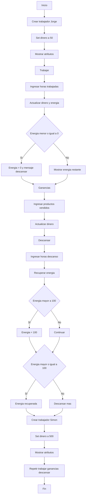

Hola, soy estudiante de primer año de programacion, necesito que me hagas un diagrama de flujo utilizando Mermaid con el siguiente codigo:

```mermaid
flowchart TD

A[Inicio] --> B[Crear trabajador Jorge]
B --> C[Set dinero a 50]
C --> D[Mostrar atributos]

D --> E[Trabajar]
E --> F[Ingresar horas trabajadas]
F --> G[Actualizar dinero y energia]

G --> H{Energia menor o igual a 0}
H -- Si --> I[Energia = 0 y mensaje descansar]
H -- No --> J[Mostrar energia restante]

I --> K[Ganancias]
J --> K

K --> L[Ingresar productos vendidos]
L --> M[Actualizar dinero]

M --> N[Descansar]
N --> O[Ingresar horas descanso]
O --> P[Recuperar energia]

P --> Q{Energia mayor a 100}
Q -- Si --> R[Energia = 100]
Q -- No --> S[Continuar]

R --> T{Energia mayor o igual a 100}
S --> T

T -- Si --> U[Energia recuperada]
T -- No --> V[Descansar mas]

U --> W[Crear trabajador Simon]
V --> W

W --> X[Set dinero a 500]
X --> Y[Mostrar atributos]

Y --> Z[Repetir trabajar ganancias descansar]

Z --> AA[Fin]
```
